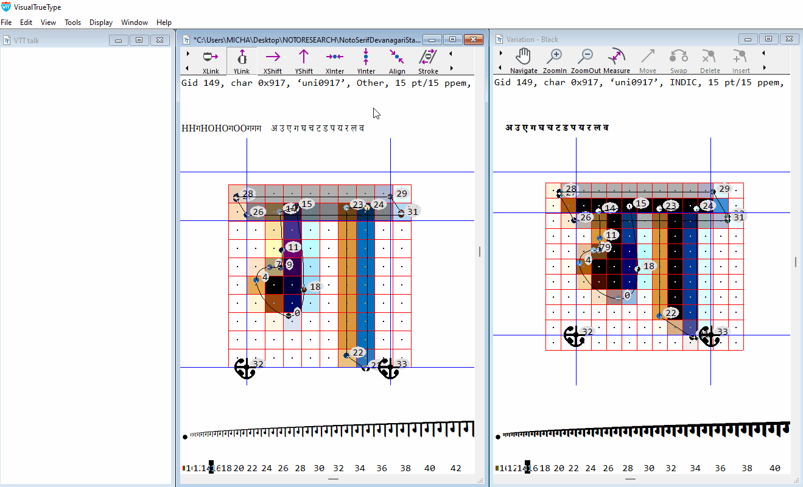

# A guide to hinting complex script Variable Fonts with Visual TrueType

by [Michael Duggan](https://twitter.com/mickduggan), in collaboration with Kalapi Gajjar-Bordawekar 

**Note:** This document is a companion piece to the comprehensive documentation on [Hinting Latin TrueType Variable Fonts with Visual TrueType](https://github.com/googlefonts/how-to-hint-variable-fonts#introduction) 

*Please refer first to this documentation for all of the details of the workflow, thorough descriptions of the hinting code, and how to use the Visual TrueType Tool to add hinting to Variable Fonts.*  

## Introduction

When thinking about adding hinting to any Variable font, it is a good idea to ask a few questions before beginning. How does hinting work in modern rendering environments? What value can hinting add? Is hinting suitable for my font? The first two questions are answered in the longer VTT Variable font Hinting document, referenced above, which gives an overview of the current rendering technologies and the main benefits of modern hinting, with a focus on Variable Font Hinting. The third question can be answered by a series of tests and proofing in VTT. 

**Is hinting suitable for the font?**
Once you know more about what hinting is capable of, you can then ask a few questions about the font itself. Is the font intended for reading on-screen at smaller sizes or is it primarily a display font, intended for use only at larger sizes? If the latter, is hinting really needed? What benefits can I expect by adding hinting? How complex are the outline shapes? Many complex script fonts can benefit from hinting particularly at smaller sizes. However, for some scripts, such as Chinese, Japanese and Korean for example, the complexity of the outlines makes it impossible to apply hints that will benefit smaller sizes. Once there are enough pixels at larger sizes, hinting can help to sharpen common horizontal strokes and reduce blur. Every font should be evaluated to begin with, to determine the most appropriate hinting strategy. 

We will look at these questions as we progress through this document, and will also look at the different approaches to hinting individual glyphs, and some of the current limitations of Hinting for Variable fonts.

## VTT Autohinting for complex script Variable Fonts

Before beginning any new Hinting project, it is also important to understand the options and requirements for running the VTT Autohinter for complex script Variable fonts. The Visual TrueType tool has the following options for Autohinting.

**(1) Light Latin Autohinter:** Designed to work for Latin fonts, including Greek and Cyrillic. This option can also be used to add hinting to complex script fonts. **Note:** To run the VTT Light Latin Autohinter, for complex script fonts, VTT requires that the font must contain at least the Latin Ascii glyph set. If there is no Latin Ascii glyph set, the Light Latin Autohinter will not run, and will return an error message. _(Example: Unicode 0x48 (H) is missing in this font)._

If your font contains a Latin and a complex script glyph set, the Latin portion of the font will be auto-hinted, with cvt’s generated for key Latin Heights. The Autohinter will add hinting code to the complex script glyph set, but will not generate cvt’s for any heights. Although the VTT Autohinter does not add cvt information for heights for complex script glyph sets, it is worthwhile running it, to begin any hinting project. In addition to adding basic hinting code, VTT also generates a full Font-Program and Pre-Program as well as code for any composites in the font. This saves a lot of time versus building this information from scratch. The basic hinting code that is added to the individual complex script glyphs can also be a good starting point to build from. We will look at this in more detail in the examples of hinting later in the Document.

**(2) EA Autohinter:** If a font does not contain a Latin subset, or you do not wish to add these glyphs you can run the VTT East Asian Autohinter. Using this option VTT will autohint a font without the requirement to add a Latin glyph set. If the hinting strategy used by the East Asian Autohinter is appropriate for you font, you can proceed from here using the code generated by the EA Autohinter. This will also include all of the necessary tables, Font-Program and Pre-Program. This Autohinter makes use of a lightweight hinting strategy that focuses on the horizontal strokes common in East Asian scripts. The strategy, takes advantage of Windows symmetric rendering modes and locks one side of horizontal strokes to the pixel grid while letting the top of other side float. This strategy balances edge contrast vs. blur and produces a good distribution of strokes with balanced counters. 

**Note:** _If your font does not contain a Latin subset, and the approach used by the EA Autohinter is not suitable for the font you are working on, you can run the EA Autohinter, save, and then run the Light Latin Autohinter. Once the font has been saved after running the EA Autohinter, VTT allows for the Light Latin Auothinter to run on a font, that does not contain a Latin Subset. The autohinting approach used by the EA and Light Latin Autohinter, differs slightly. The EA autohinter, adds hints to the bottom of horizontal strokes and hints upwards, while the Light Latin Autohinter adds hints to the y-min of glyphs and hints up, and adds hints to the top of y-max of strokes and hints downwards. The Autohinting code output, should be reviewed and the font proofed carefully, to determine which approach is suitable for your font._

**(3) Control program only:** This option is similar to number 1 above, and has the same requirements for the inclusion of Latin glyph set. The ‘Control program only’ option, is used only when the intent is to add hinting to the font from scratch, via the graphical hinting interface or by writing the High Level VTT Talk by hand. The Control Program option will generate, a simple CVT Table, Font Program and will generate glyph program code for composite glyphs. **Note:** Hinting code for the unique glyphs in the font will not be generated. 

## Case Study: Hinting Noto Devanagari Serif Variable font

As an example of Hinting complex script Variable fonts, we will be looking at the workflow for autohinting and then fine tuning the hinting code, for key representative glyphs in the Noto Devanagari Serif Variable font. Noto is a global font collection for writing in all modern and ancient languages. Noto Serif Devanagari is a modulated (“serif”) design for setting texts in the Indic Devanagari script. The Variable font supports multiple weights and widths. 

All of the concepts, processes and workflow can be followed and adapted for other complex script Variable fonts. 

**Determining benefits of Hinting by running the Autohinter**

A good way to begin, to evaluate the overall effects of hinting, is to run the VTT Autohinter, and review the output.

Follow the workflow steps 1 and 2, as described in [How to Hint Variable fonts](https://github.com/googlefonts/how-to-hint-variable-fonts)

**Step 1:** [Autohinting a Variable Font](https://github.com/googlefonts/how-to-hint-variable-fonts#vtt-variable-font-workflow-process)

**Step 2:** [XML, Export and Import Hinting code](https://github.com/googlefonts/how-to-hint-variable-fonts#xml-export-and-import-hinting-code)

Sharpening of horizontal strokes at smaller screen sizes on lower resolution screens is one of the key benefits of modern hinting. This sharpening significantly reduces blur along key horizontal strokes, producing much clearer text at smaller sizes on-screen. 

Running the VTT Autohinter and quickly reviewing the results will give you a good impression of the big picture of how hinting will help to render the font at small screen sizes particularly in relation to the key horizontals in the Devanagari font design. By evaluating the initial results produced by the Autohinter, you can determine the benefits of hinting and then build on refining the hinting code. 

**Left** Horizonal stroke un-hinted. After the un-hinted outline is scaled and rendered at a particular size, the result is very often a blurred line.
**Right** Horizonal stroke hinted. The Autohinter uses a strategy to move the outline to a high contrast grid boundary.

Following on from this basic idea, we can now see how this hinting effect, improves the rendering overall for many of the main Devanagari glyphs.

**Key Horizonal sharpening** Hinting results in sharpening of main Horizontal stokes, along the key Devanagari Headline alignment zone, shown here using representative Devanagari glyphs at 9 and 12 point @96dpi

**Improvements across Variation space** One set of hinting code is applied to all weight and width variations in the Variable font, resulting in consistent sharpening of main Horizontal stokes for all widths and weights. 

**Devanagari text sample** 

Text Sample comparing hinted to un-hinted / Typeset at Axis-praxis.org / Universal Declaration of Human Rights / NotoSerifDevanagariVF_Demo.ttf, 15px, 11point@96dpi, Google Chrome (Version 99.0.4844.51) / Windows 11 / DirectWrite Rendering / Consistent sharpening and alignment along Headline of all Devanagari glyphs. Key details are kept clear on-screen at smaller text sizes

## Determining key height Alignments and measurements

Before beginning any edits or fine tuning of the hinting of the font, cvt’s for key heights should be created. If you are familiar with the script or the alignment heights are obvious, you can add new cvt’s for key heights, and overshoot features as described below for the Devanagari Variable font. 

If you are not familiar with the script, it is best to work with a script expert or by referencing trusted documentation online, to firstly determine the main aligment zones or key heights for the font. Once these have been established, measurements can be taken from key representative glyphs, and new custom cvt’s can be added to the CVT table.

You can add as many new cvt’s as needed for heights or features. Typically a new cvt is added for a height for example, that is shared by many glyph in the font. Referencing these new cvt’s in the hinting, will ensure a consistent alignment of the hinted glyphs, and will also allow for global adjustments to heights to improve readability at smaller sizes. 

Key heights are determined by referencing some representative glyphs in the Noto Devanagari Variable font. The measurements taken from these glyphs, will be used to set up new cvt’s that will be referenced in the hinting code.

Referencing ‘cvt’ values from hinting instructions in a set of glyphs that share similar measurements in the Devanagari font allows strict control over the regularity of these features. For the hinting approach described here, new cvt’s will be used to ensure key heights are kept consistent at any given point size. When adding hints, an ‘anchor’, _(such as is added by the Autohinter)_ on any point, will be rounded to the nearest grid line. However, a YAnchor, _for example,_ can refer to a ‘cvt’ value to specify a height or overshoot shared by other glyphs in the font. Instead of rounding to the nearest grid line, the anchored point will round to the grid line specified by the ‘cvt’ value. 

This is also useful when making global adjustments to heights, and proportions for a range of glyphs, by adjusting just one cvt. Global adjustments to proportions in complex script fonts, can help provide more space for heavier weights, for example, helping to make the rendering much clearer on-screen.
 
## Adding Character Group information and CVT’s for Devanagari 

**Character Group Information**

Before beginning hinting we will need to add Character group information for Devanagari. 

Open the Control program `ctrl + 4`. Anywhere at the begining of the Control Program type GROUP INDIC, to declare a new group, for the Devanagari glyphs. _Additional character groups can be added as needed._

Compile the Control Program and save. When this is done, you will be able to select the appropriate Character group for the current glyph in the Main Window. The ‘character group’ tells VTT which group of values to use from the Control Value Table. As you add the hinting, via the Graphical User Interface hinting tools, VTT will automatically pick the correct cvt’s for heights that have been newly defined and declared as ‘INDIC’ in the Contol Value Table table. 

**To change the character group to ‘Indic’ for the current glyph**

From the edit menu, choose ‘Change Char group’. A shortcut for this is to press Ctrl+U. Repeat `ctrl + u`, until ‘INDIC’ is listed as the ‘Character Group’ information in the text string at the top of the main Window. 

**Adding new cvt’s for Devanagari**

Now that we have taken some measurements from the font outlines, we can build some new cvt’s for use in hinting the Devanagari. The illustration above shows four key measurements taken from representative glyphs. We can add further cvt’s when required, for any other alignment zones, that can be determined in the font.

To add the new cvt’s, open the Control program. At the end of the control program add the following cvt entries, starting with the next available ID number, in this case cvt number 167. _(Because this font contains a Latin Subset, the Autohinter has already generated cvt’s for the Latin font)_

To begin, declare the new cvt’s as ‘INDIC’. 

**Note:** The cvt setup, for the main Devanagari heights, uses the same method as used in Latin fonts. For the Devanagari height cvt’s, Indic is declared first, then the color of the link, which is Grey, for heights, and the direction Y. ‘Square Height’ is added before the cvts for the Flat heights, _‘Flat Headline height’_ and _‘Baseline’,_ and ‘Round Height’, is added before the round overshoot heights, round _‘Devanagari Headline Overshoot’_ and round _‘Devanagari Baseline Undershoot’._ 

Add four new cvt’s, for ‘Main Devanagari Flat Headline height’, ‘Round Devanagari Headline Overshoot’, ‘Devanagari Baseline’, and ‘Devanagari Baseline Undershoot’ using the measurements taken from the outlines. Compile and Save the Control Program. These new cvt’s are now available for use, and can be referenced in the VTTtalk Hinting code of individual glyphs.

/***** Devanagari Height cvt’s *****/
 
 INDIC 

      Grey 

      Y

      SquareHeight

      167:   623 /* Main Devanagari Flat Headline height */
  
ASM("SVTCA[Y]")

ASM("CALL[], 167, 89")
 
      169:     0 /* Devanagari Baseline */

ASM("SVTCA[Y]")

ASM("CALL[], 169, 89")

  RoundHeight

      168:    5 ~   167 @ 42 /* Round Devanagari Headline Overshoot*/

      170:   -5 ~   169 @ 42 /* Devanagari Baseline Undershoot */

## Hinting Devanagari letter GA (Unicode+0917)

Let’s begin by looking at how to add hinting to the Devanagari letter GA. In this example we will delete the existing Autohinting code and add the hinting via the graphical user interface. The main height controls and cvt’s added to this glyph will set the direction for adding hinting and maintaining consistent height control for other Devanagari glyphs, that share the same headline and baseline heights. Many of the glyphs in the font share a common alignment. 

**Hinting strategy**

1. Control the y-max (Headline) and y-min of the glyph (Baseline / baseline undershoot) to be consistent with other glyphs that share the same alignment, using values in the Control Value Table as a reference. Minimise blur at the ‘Headline’.

2. Control the position of the middle element, in relation to the Baseline and Headline. 

**Hinting the GA (Unicode 0917)**

Before beginning hinting, while in the main window, set the correct ‘character group’, for the current glyph. The ‘character group’ information for each character is listed in the text string at the top of the Main Window, and appears like this

Gid 149, char 0x917, ‘uni0917’, **INDIC** _(Character group information)_

The ‘character group’ tells VTT which group of values to use from the Control Value Table. As you add the hinting, VTT will automatically pick the correct cvt’s for heights that have already been newly defined for INDIC in the cvt table. 

**To change the character group to ‘INDIC’ for the current glyph**

From the edit menu, choose ‘Change Char group’. A shortcut for this is to press Ctrl+U. Repeat `ctrl + u`, until ‘INDIC’ is listed as the ‘character group’ information in the text string at the top of the main Window.

**Step 1: Devanagari Headline Height Control** 

Choose the YShift Tool from the Toolbar. Position the ‘blue circle’, directly over point 28, click, and drag to point 26 and release. 

The following code is generated in the VTT Talk Window.

**YAnchor (28, 167)** Moves point 28 to the control value listed in the ‘Control Program’, that corresponds to the Devanagari Main Flat Headline Height, (cvt #167) and rounds this point to a grid line. (View > Control Program:  (167: 623 /* Main Devanagari Flat Headline Height */) 

**YShift(28,26)** Shifts point 26, to a new position, relative to point 28’s new position on the grid, maintaining the same relative distance between the point 28 and point 26 as is in the original high resolution design of the outline. The shift command does not reference a cvt value and does not move the hinted point 26 to a full pixel grid line. Shift also does not default to a one pixel minimum used by the Link command. Using the Shift command will maintain a balanced visual weight, of this important Devanagari horizontal feature , across all variations.

With the Yshift Tool still selected, drag from point 26 to point 14 and from point 14 to point 23. The following code is generated.

**YShift(26,14)**
**YShift(14,23)**

 Shifts point 14, to a new position, relative to point 26’s new position maintaining the same relative distance between point 26 and point 14, and point 23, as is in the original high resolution design of the outline. Point 14 and point 23 are now positioned correctly across all variations in the design space.

**A note on Hinting overlapping outlines**
 *Variable fonts are often designed with outlines that overlap. To ensure the hinted font renders correctly it is important to add hinting to points on the outline that overlap, so that these points maintain their correct position in the hinted outline. In this case, the shift command from point 26 to point 14 and 23, will ensure that point 14 and 23, maintain the correct position in the hinted outline, in the y-axis, between points 28 and 26. **Note:** An alternative method to control the correct positions for these overlapping points, is to interpolate points 14, 15, 23, 24, between points 28, and 26 in the y-axis using YInterpolate(28,14,15,23,24,26). The overall effect is the same*

**Step 2: Devanagari Baseline Height Control** 

With the YShift Tool still selected from the toolbar, position the ‘blue circle’, directly over point 21, and right click. With the right mouse button held down, drag to the right to select ‘round to grid’ then release. 

The following code is generated in the VTT Talk Window.

**Yanchor(21, 170)** Moves point 21 to the control value listed in the ‘Control Program’, that corresponds to the Devanagari Baseline Undershoot Height, (cvt #170) and rounds this point to a grid line. (View > Control Program:  (170: -5 /* Devanagari Baseline Undershoot */)

**YShift(21,22)** With the Yshift Tool still selected from the toolbar, position the ‘blue circle’, directly over point 21, and drag to point 22. Shifts point 22, to a new position, relative to point 21’s new position on the grid, maintaining the same relative distance between the point 21 and point 22 as is in the original high resolution design of the outline. 

**Step 3: Control position of mid-section of glyph in Y-axis** 

Now that the Baseline and Headline Height have been established the middle section now needs to be interpolated to find its correct position. 

Choose the YInterpolate tool. Position the _‘blue circle’_, directly over point 28 and drag to point 21. You will see a line appear, which takes the form of a draggable _‘elastic band’._ No code is generated yet until a point is chosen to interpolate. Click anywhere on the line, and drag the curser to the point you want to interpolate, in this case point 0, and release. The following code is generated in the VTT Talk Window.

**YInterpolate(21,0,28)**

The middle section is now positioned correctly, between the base line and Headline height but one more step is needed. To maintain as much contrast as possible and to reduce blur, one side of the middle element, should be aligned to the pixel grid. Right click on point 0, drag to the right to ‘round to grid’, and release. The YInterpolate code, will be replaced with the following code.

**YIPAnchor(21,0,28)**

Moves point 0, to full pixel grid, positioned relative to point 28 and point 21, which now has a new grid-fit position. This ensures high contrast on the bottom of the middle section of the GA glyph helping to minimise blur.

**Step 4: Control weight of mid-section** 
Choose the YShift tool. Position the _‘blue circle’_, directly over point 0 and drag to point 7. The following code is generated in the VTT Talk Window.

**YShift(0,7)**
Shifts point 7, to a new position, relative to point 0’s new position on the grid, maintaining the same relative distance between the point 0 and point 7 as is in the original high resolution design of the outline. 

**Step 5: Adding the Res command** 

The Res addition to the command ‘Anchor’, for example, stands for ‘Rendering Environment Specific’, and ensures that the appropriate rounding happens, for various rendering environments. This saves adding additional hinting commands if hinting is required to work in a variety of rendering environments. _The Res command calls a Function, that is designed to also allow for more subtle rendering of features such as undershoots and overshoots_

Switch to the VTTtalk window (`ctrl + 5`). Type Res before the YAnchor commands, Compile VTT Talk, (`ctrl + r`) and save (`ctrl + s`)

The final VTTtalk code, for the GA glyph, in the VTTtalk window will appear like this. The Res commands and cvt’s are highlighted here. After appending the Res commands to the YAnchors, compile the VTTtalk window and save. 

/* Y direction */

**Res**YAnchor(21 **,170**)  /* Devanagari Baseline undershoot */

YShift(21,22)

**Res**YAnchor(28 **,167**) /* Main Devanagari Flat Headline height */

YIPAnchor(21,0,28)

YShift(0,7)

YShift(28,26)

YShift(26,14)

YShift(14,23)

Smooth()

_The hinting for GA is now complete. Additional glyphs that share the same alignment can now be hinted using the same overall strategy and reference the same cvt values. Glyphs can be proofed in the main window, using the text string to see shape and spacing, in the size ramp to see the hinted results at a range of sizes, and in the Variation Window, to proof for all variations in the font._

**Pro Tip** 

**Notes on adding new cvt’s**

When adding new hinting code from scratch, or when editing the output from the Autohinter, choose the option under `Display > Options > VTT Attributes` > **Show CVT numbers.** 

When new cvt’s are added, the cvt numbers will be shown graphically in the main window. As you progress through hinting the glyph set, showing cvt numbers allows for easier visual proofing of the hinted glyphs in the Main Window, for example to quickly determine whether the correct cvt’s are used for heights. 

## Hinting Devanagari vowel sign AA (Unicode+0x93e)

**Hinting strategy**

1. Control the y-max (Headline) and y-min of the glyph (Baseline undershoot) to be consistent with other glyphs that share the same alignment, using values in the Control Value Table as a reference. Minimise blur at the ‘Headline’. Control weight of top horizontal bar. Control outline overlap. 

**Editing Autohinter code**

The VTT Autohinter is designed to speed up the workflow for hinting. While for Latin fonts, the Autohinter generates hinting code as well as cvt’s, the output is often still a very useful starting point when hinting complex script fonts. Lets take a look at the following example. The code structure overall that has been generated by the Autohinter for this glyph, is sound. We just need to add the appropriate Devanagari height cvt’s, to the YAnchor commands, via the Graphical User hinting tools, control the overlap, and add the ‘Res’ commmand, to the YAnchor’s in the VTT Talk. 

From the edit menu, choose ‘Change Char group’. A shortcut for this is to press Ctrl+U. Repeat `ctrl + u`, until ‘INDIC’ is listed as the ‘character group’ information in the text string at the top of the main Window.

**Add Devanagari Headline cvt**

Right click on the anchor symbol associated with point 7, and drag to the right to select the cvt symbol. The following code is generated. **Note:**_(You may have to zoomin to the point to see this clearly in VTT)_

**Note:** We have already built the cvt’s for the main heights in Devanagari, and have delared these in the cvt table as ‘INDIC’. Once the Char group info is set for the current glyph, VTT will know to assign the correct cvt’s for the Devanagari Heights. 

**YAnchor(7, 167)**

Cvt 167 is appended to the Yanchor code that controls the top alignment, and moves point 7 to the control value listed in the ‘Control Program’, that corresponds to the Main Devanagari Flat Headline height.

167: 623 /* Main Devanagari Flat Headline height */

**Add Devanagari Baseline undershoot cvt**

Right click on the anchor symbol associated with point 0, and drag to the right to select the cvt symbol. The following code is generated. 

**YAnchor(0,170)**

Cvt 170 is appended to the Yanchor code that controls the bottom alignment, and moves point 0 to the control value listed in the ‘Control Program’, that corresponds to the Devanagari Baseline undershoot height.

170: -5  /* Devanagari Baseline Undershoot */

**Control outline overlap** 

With the Yshift Tool still selected, drag from point 5 to point 2 The following code is generated.

**YShift(5,2)**

Shifts point 2, to a new position, relative to point 5’s new position maintaining the same relative distance between point 5 and point 2, as is in the original high resolution design of the outline. Point 2 will now be positioned correctly across all variations in the design space.

**Add Res command**

Switch to the VTTtalk window (ctrl + 5). Type Res before the YAnchor commands that have cvt’s associated with them, here it is YAnchor(0, 170), and YAnchor(7, 167)

Compile VTT Talk, (ctrl + r) and save (ctrl + s).

The hinting for the Devenagari vowel sign AA (Unicode+0x93e), is now complete and ready for proofing. 

## Hinting Devanagari letter DdA (Unicode+0921)

Adding Hinting for a complex Devanagari glyph. 

**Hinting strategy**

1. Control the y-max (Headline) and y-min to be consistent with other glyphs that share the same alignment, using values in the Control Value Table as a reference. Minimise blur at the ‘Headline’, and y-min of the glyph

2. Control the position of the middle elements, in relation to the y-min and Headline. The main advantages of adding hinting to this glyph will be to ensure that the top and bottom of the glyph are moved to a sharp alignment. Because we have to use only one set of hints for all of the variation weights, from Light to Black, control of the middle is done by interpolation only. This will ensure that the overall shape of the glyph is correctly maintained. 

While in the main window, choose ‘Change char group’, from the edit menu. A shortcut for this is to press `ctrl + u`. Repeat `ctrl + u`, until ‘INDIC’ is listed as the ‘character group’ information in the text string at the top of the main Window. _(Listed after the Unicode and before the ppem size)_

**Control Top alignment** 

Choose the YShift Tool from the Toolbar. Position the ‘blue circle’, directly over point 51, click, drag to point 49 and release. 

The following code is generated in the VTT Talk Window.

**YAnchor (51, 167)** Moves point 51 to the control value listed in the ‘Control Program’, that corresponds to the Devanagari Main Flat Headline Height, (cvt #167) and rounds this point to a grid line. (View > Control Program:  (167: 623 /* Main Devanagari Flat Headline Height */) 

**Control top horizontal weight** 

**YShift(51,49)** 

Shifts point 49, to a new position, relative to point 51’s new position on the grid, maintaining the same relative distance between the point 51 and point 49 as is in the original high resolution design of the outline. Using the Shift command will maintain a balanced visual weight, of this important Devanagari horizontal feature , across all variations.

**Control outline overlap** 

With the Yshift Tool still selected, drag from point 49 to point 26 The following code is generated.

**YShift(49,26)**

Shifts point 26, to a new position, relative to point 49’s new position maintaining the same relative distance between point 49 and point 26, as is in the original high resolution design of the outline. Point 26 will now be positioned correctly across all variations in the design space. **Note:** _Because point 27 is at the same y-horizontal measurement as point 26, there is no need to use a shift command to touch point 27. Point 27 will move automatically to the same y-position as point 26._

**Control bottom alignment** 

With the YShift Tool still selected from the Toolbar. Position the ‘blue circle’, directly over point 0, right click, and drag to the right to select a cvt.

The following code is generated in the VTT Talk Window.

**YAnchor (0, 169)** Moves point 0 to the control value listed in the ‘Control Program’, that corresponds to the Devanagari Baseline (cvt #169) and rounds this point to a grid line. (View > Control Program:  (167: 623 /* Main Devanagari Flat Headline Height */)

**Disable cvt selection** 
Right click on the Anchor symbol associated with point 0, drag to the left to disable cvt selection. The following code is generated

YAnchor(0)

**Note:** 
_In this case VTT will try and choose the cvt closest to the baseline for Devanagari. The outline measurements of the high resolution outline differs across the variation space however. In the Thin Weight point zero is positioned at a y-measurement of +13 font units, while in the Black Weight point zero is positioned at a y-measurement of -3 font units, below the baseline. Moving point zero to reference a cvt in this case will work for smaller screen sizes, where there are fewer pixels, but will position point zero incorrectly at higher sizes, causing the bottom round in the Thin weight to round to low, and too high in the Heavy weight. In this case its best to use a YAnchor command, without a cvt reference, to round this feature to the grid, allowing the bottom of the y-round to round to the oulines naturally scaled outline position. This method will work for both smaller sizes, where the rounding will naturally round to the baseline, and at larger sizes, when there are more pixels available, to round to the correct position across the variation weight range._

**Control bottom round weight** 

With the YShift Tool selected from the Toolbar, drag from point 0 to point 7 and release. 

**YShift(0,7)** Shifts point 7, to a new position, relative to point 0’s new position on the grid, maintaining the same relative distance between the point 0 and point 7 as is in the original high resolution design of the outline.

**Control position of middle curves**

Choose the YInterpolate tool. Position the ‘blue circle’, directly over point 51, drag to point 0. You will see a ‘line’ appear, which takes the form of a draggable ‘elastic band’. No code is generated yet until a point or points are chosen to interpolate. Click anywhere on the interpolation line, and drag to the points on the middle curves you wish to interpolate, in this case points 13, 39, 22 and 30 and release. the following code is generated

**YInterpolate(0,13,39,30,22,51)** 

This will position the middle curves corectly across the weight variations, relative to the grid fitted positions of the y-min and y-max of the glyphs. When hinting more complex, dense glyphs in Variable fonts, it is often better to use an interpolation for positioning middle elements, rather than trying to place these elements onto the grid. Grid-fitting the curves in this case may work for the light weights, but may cause clashing or black spots, at smaller sizes in the bolder weights. 

**Add Res command**

Switch to the VTTtalk window (ctrl + 5). Type Res before the YAnchor command that has a cvt associated with it, here it is YAnchor(51,167). Compile VTT Talk, (ctrl + r) and save (ctrl + s).

The hinting for the Devanagari letter DdA (Unicode+0921), is now complete and ready for proofing. 

## Adjusting global proportions

At small screen sizes there are a limited number of pixels available to describe and render more complex glyph shapes. Adjusting the overall height of the Devanagari glyphs, can help to make the glyphs, that are more complex and dense, clearer and more open, particularly in the heavier weights. 

In this example the Main Headline Devanagari height ‘cvt’ 167, stores a measurement of 623 font units, which is the measured outline distance of the square Headline Height. 

At 12 point at 72dpi / 9 point at 96dpi, this value is scaled, and rounds to the nearest pixel grid, which results in a Baseline to Headline Height of 7 pixels () 

At 15 point at 72dpi / 11 point at 96dpi, this value is scaled, and rounds to the nearest pixel grid, which results in a Baseline to Headline Height of 9 pixels ()

At 20 point at 72dpi / 15 point at 96dpi, this value is scaled, and rounds to the nearest pixel grid, which results in a Baseline to Headline Height of 7 pixels ()
 
To change this height globally, a ‘Delta’ command is used to raise the Headline Height for all glyphs that reference the ‘cvt’ for either square or round Headline height. This Delta command raises the Headline Height by one pixel for all of the instances in the font. 

**Note:** When adjusting one height, other heights should also be reviewed, and adjusted if necessary, to ensure the correct proportion is maintained, between heights.
 
**Globally adjust height in the ‘cvt’ table:**

Open the CVT Table (`ctrl + 4`) and refer to the ‘cvt’ for Headline Height, ‘cvt’ number 167. Directly after the ‘cvt’ type the following, Delta(1@12;15;20) and compile, ctrl ( r ) and save.
 
**CVT Entry for Square Devanagari Headline Height**
167:  623 /* Square Headline Height */
 
Delta(1@12;15;20) /* Raise Headline Height globally by 1 pixel */
 
**Note:** In Variable fonts a global Delta command can only be used, if the cvt does not vary across the Variation Space. For example, a Bolder weight variation may have a larger measured outline height. This height is edited in the ‘cvar’ _(cvt variation table)_ to reflect this difference. Because of the difference in height, the bolder weight cvt, can round differently and the ‘Delta’ to change the height for the Bold may not be required. Refer here for more information on [editing the CVAR Table](https://github.com/googlefonts/how-to-hint-variable-fonts#cvar--cvt-variations-table)

## Hinting components and accents

**Hinting strategy for components and accents**

1. Ensure hinted glyph is at least two pixels in height at all sizes for all variations, making it render clearly at lower sizes on-screen.
2. Hint the bottom of the glyph to align to the grid, using a cvt height as a reference
3. Hint from bottom to top of glyph, to ensure top or y-max is aligned to a sharp grid boundary.
4. Control weight of y-straight or y-round accent stroke
4. Maintain a minimum distance white space, in accents that need to kept clear. 

_The Autohinter has no special strategy for hinting accented glyphs. By locking the top and bottom of the accent to the grid, the autohinter code can cause accents to collapse to one pixel in height, which is too small to describe a typical accent or component._

_To ensure the best readable solution, accents that need it, should be hinted to be a minimum of two pixels in height for all sizes_

**Note:** In the example animation above, the y-min of the component glyphs, Uni0947 & Uni0948, reference a cvt of 171, which stores the measured outline y-min. The outline measurement for these components is lower than the main headline height. This is done to maintain an overlap when combined above another base glyph.

Using inheritence, Cvt 171 is then forced to be equal to the main headline height cvt 167. This will ensure that the components, when they are used in composite glyphs, are displayed at the exact same hinted height as the main straight Headline height, for all variations. At higher sizes, when there are enough pixels, the accent can revert to using its measured height.

A new cvt can be created for any group of accents or components, that share the same y-direction alignment. This will ensure that when accents are referenced in composite glyphs a consistent display and alignment will be maintained. 

## Demo font NotoSerifDevanagariVF_demo.ttf

Please refer to the [demo font](https://github.com/googlefonts/how-to-hint-non-latin-variable-fonts/tree/main/VTTSourcesDemoFont) to review the methods used for hinting the Noto Devanagari Variable font. A selection of the glyphs have comments on the hinting included in the VTTtalk (see list below). **Note:** _Any edits made to the hinting, using the Graphical user interface, in any of these glyphs, will result in the comments being lost.The following glyphs have have been fine-tuned, and cvt’s added_

**Hinted and fine tuned glyphs:** _(Gid 98 / Uni 0x0905), (Gid 102 / Uni 0x0909), (Gid 108 / Uni 0x090F), (Gid 149 / Uni 0x0917), (Gid 150 / Uni 0x0918), (Gid 152 / Uni 0x091A), (Gid 157 / Uni 0x091F), (Gid 159 / Uni 0x0921), (Gid 167 / Uni 0x092A), (Gid 172 / Uni 0x092F), (Gid 173 / Uni 0x0930), (Gid 174 / Uni 0x0932), (Gid 175 / Uni 0x0905)_