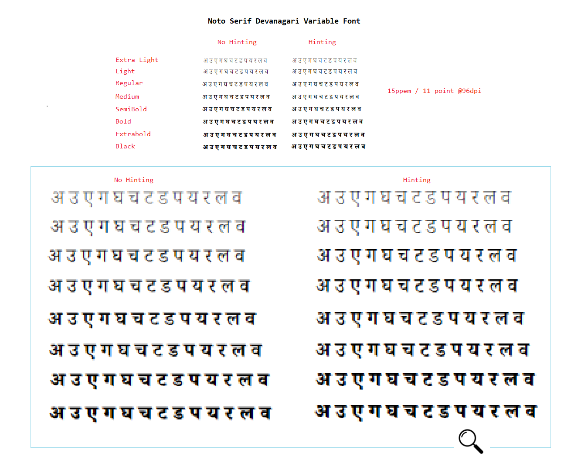

# A guide to hinting Non Latin TrueType Variable Fonts with Visual TrueType

by [Michael Duggan](https://twitter.com/mickduggan)

## Hinting Non-Latin Variable fonts in VTT (Visual TrueType) 

**Note:** This document is a companion piece to the longer [Hinting Latin TrueType Variable Fonts with Visual TrueType](https://github.com/googlefonts/how-to-hint-variable-fonts#introduction) 

*Please refer first to this comprehensive documentation for all of the details of the workflow, detailed descriptions of the hinting code, and how to use the VTT Tool to add hinting to Variable Fonts..*  

**Notes on running the VTT Autohinter for Variable Non-Latin Fonts**

Before beginning any new Hinting project, it is important to understand the options and requirements for running the VTT Autohinter for Non-Latin Variable fonts. VTT has the following options for Autohinting.

**(1) Light Latin Autohinter:** Designed to work for Latin fonts, including Greek and Cyrillic. This option can also be used to add hinting to Non-Latin fonts. Note: To run the VTT Light Latin Autohinter, for Non-Latin fonts, VTT requires that the font must contain at least the Latin Ascii glyph set. If there is no Latin Ascii glyph set, the Light Latin Autohinter will not run, and will return the following error message. (Unicode 0x48 (H) is missing in this font). 

If your font contains a Latin and a Non-Latin glyph set, the Latin portion of the font will be auto-hinted, with cvt’s generated for key Heights. The Autohinter will add hinting code to the non Latin glyph set, but will not generate cvt’s for any heights. Although the VTT Autohinter does not add cvt information for heights for Non Latin glyph sets, it is worthwhile running it, to begin any hinting project. In addition to adding basic hinting code, VTT also generates a full Font-Program and Pre-Program as well as code for any composites in the font. This saves a lot of time versus building this information from scratch. The basic hinting code that is added to the individual Non Latin glyphs can also be a good starting point to build from. We will look at this in more detail in the example Hinting later in the Document.

**(2) EA Autohinter:** If a font does not contain a Latin subset, or you do not wish to add these glyphs you can run the East Asian Autohinter. Using this option VTT will autohint a font without the requirement to add a Latin glyph set. If the hinting strategy used by the East Asian Autohinter is appropriate for you font, you can proceed from here using the code generated by the EA Autohinter. This will also include all of the necessary tables, Font-Program and Pre-Program. This Autohinter makes use of a new lightweight hinting strategy that focuses on the horizontal strokes common in East Asian scripts. This strategy, takes advantage of Windows symmetric rendering modes and locks the bottom of strokes to the pixel grid while letting the top of strokes float, by using a ‘Shift’ command. This strategy balances edge contrast vs. blur and produces a good distribution of strokes with balanced counters. The Autohinting code output, should be reviewed and the font proofed carefully, to ensure this approach is suitable for your font. 

**(3) Control program only:** This option is similar to number 1 above, and has the same requirements for the inclusion of Latin glyph set. Using the control program only Autohinting option, is used when the intent is to add hinting to the font from scratch, via the graphical hinting interface or by writing the High Level VTT Talk by hand. The Control Program option will generate, a simple CVT Table, Font Program and will generate glyph program code for composite glyphs. Hinting code for the unique glyphs in the font will not be added. 

## Introduction

When thinking about adding hinting to any Variable font, it is a good idea to ask a few questions first. How does hinting work in modern environments? What value can hinting add? Is hinting suitable for my font? The first two questions are answered in the longer VTT Variable font Hinting document, referenced at the beginning, which gives an overview of the current rendering technologies and the main benefits of modern hinting, with a focus on Variable Font Hinting. The third question can be answered by a series of tests and proofing in VTT. 

As an example of Hinting Non Latin Variable fonts, we will be looking at adding and fine tuning hinting for some key representative glyphs in the Noto Devanagari Serif Variable font. The workflow and concepts discussed for the Devanagari font, can be used for other Non-Latin Variable fonts that support different scripts. 

**Is hinting suitable for my font?**
Once you know more about what hinting is capable of, you can then ask a few questions about the font itself. Is the font intended for reading at smaller sizes or is it primarily a Display font, intended for use at larger sizes? What benefits can I expect by adding hinting? How complex are the outline shapes? Many complex scripts fonts can benefit from hinting particularly at smaller sizes. For some scripts, such as Chinese, Japanese and Korean for example, the complexity of the outlines makes it impossible to apply hints that will benefit smaller sizes. Once there are enought pixels at larger sizes, hinting can help to sharpen common horizontal strokes and reduce blur. Every font should be evaluated to begin with to determine the most appropriate hinting stragety. 

We will look at these questions as we progress through this document, and will also look at the different approaches to hinting individual glyphs, and some of the limitations of Hinting Variable fonts in VTT.

## Case Study: Hinting Noto Devanagari Serif Variable font

For the remainer of this document we will look at adding hinting to the Noto Serif Devanagari Variable font. All of the processes and workflow can be followed and adapted for other comple script Variable fonts. A good way to begin, to evaluate the overall effects of hinting, is to run the VTT Autohinter, and review the output.

**Determining benefits of Hinting by running the Autohinter**

Sharpenening of horizontal strokes at smaller screen sizes on lower resolution screens is one of the main effects of modern hinting. This sharpening significantly reduces blur along key horizontal strokes, producing much sharper text at smaller sizes. 

Running the VTT Autohinter and quickly reviewing the results will give you a good impression of the big picture of how hinting will help to render the font at small screen sizes particularly in relation to the key horizontals in the Devanagari font. By evaluating the initial results produced by the Autohinter, you can determine the benifits of hinting and to then build on refining the hinting code. 

**Left** Horizonal stroke un-hinted. After the unhinted outline is scaled and rendered at a particault size, the result is very often a blurred line.
**Right** Horizonal stroke hinted. The Autohinter uses a stragety to move the outline to a high contrast grid boundary.

Folowing on from this basic idea, we can now see how this hinting effect, improves the rendering overall for many of the main Devanagari glyphs.

**Key Horizonal sharpening** Hinting results in sharpening of main Horizontal stokes, shown here using representative Devanagari glyphs at 9 and 12 point @96dpi

**Improvements across Variation space** One set of of hinting code is applied to all weight variations in the Variable font, result in sharpening of main Horizontal stokes for all weights. 
